# UniStay — Student Property Rental Web Application

## Tech Stack

- **Backend:** Python, Flask
- **Frontend:** HTML, CSS, Bootstrap 5, Jinja2
- **Database:** MySQL

## Description

UniStay is a highly specialized property rental web application, aiming to facilitate the rental search for university students and general renters across Australia. The primary purpose of this application is to bridge the gap between traditional real estate rental websites and the specific geographic and environmental housing needs of the academic community. The target audience for this application can be categorized into two groups: international and domestic students seeking high-quality living environments and opportunities for friendship, and general tenants who need a transparent rental marketplace. The core features of the application include a highly advanced search engine for university students, a comprehensive dashboard for rental agents to manage their overseen properties, and a personalized "Saved Properties" interface that allows tenants to categorize their preferred rental properties according to their priority and personal notes.

The unique aspect of UniStay is its "Academic Peer-Proximity" discovery model. Unlike standard rental platforms that categorize properties solely by location, this solution allows university students to search specifically by their enrolled institution to identify "dominant" properties. These are rental listings characterized by a high density of tenants from the same university, allowing students to proactively choose their living environment, where they are surrounded by potentially like-minded friend both socially and academically. By highlighting these "student-dominant" areas, the platform creates a sense of community and safety for students, especially those who newly arrived in Australia, while maintaining a fully functional and professional rental interface for the general tenants.

## Features

- Property search by property name, address
- Property filter by university, price, room type, distance, amenities
- University tab navigation with nearby distance display
- Enquiry and offer system for property listings
- Bookmark system for tenants
- Agent dashboard for property management
- Admin dashboard for property and account management
- Role-based access control (Tenant, Agent, Admin)
- User authentication with SHA-256 password hashing

## Testing account

#### Agent

| Email            | Password |
| ---------------- | -------- |
| jack@agency.com  | password |
| sarah@agency.com | password |

#### Tenant

| Email               | Password |
| ------------------- | -------- |
| minh@student.edu.au | password |
| bill@student.edu.au | password |

#### Admin

| Email              | Password |
| ------------------ | -------- |
| admin@admin.com    | password |
| samsmith@gmail.com | password |

## Installation

Make sure to install the required libraries using the `requirements.txt` file.<br>
Run the following commands to install the libraries.

### Windows

```bash
py -m pip install -r requirements.txt
```

### macOS

You may need to find where mysqlserver has been installed for the following
script to set some flags.
To find where it may be installed at, execute the following command on
the terminal:

```bash
sudo find /usr -name mysql.h
```

Then, using what is found, we may need to update the variable named
`mysqlhome` if it differs from our default.

```bash
chmod +x ./mac.sh && sudo ./mac.sh
```

## Setup and run the application

1.  Change your MySQL password in `app/__init__.py` line 16

```bash
app.config['MYSQL_PASSWORD'] = '' # change your database password here
```

2. Run `database.sql` to create database and add sample data 

3.  Run `run.py` or use this command to run the application:

```bash
flask --app app run
```

## Screenshots

### Homepage

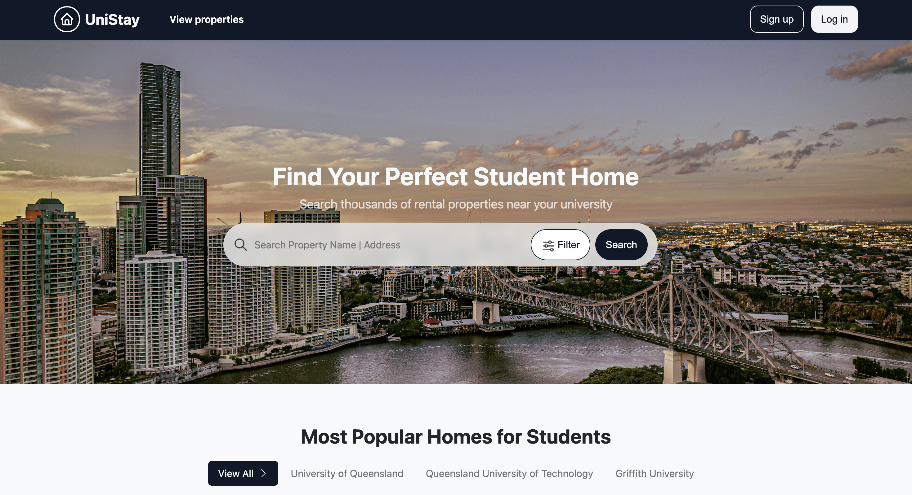

### Homepage Property Display

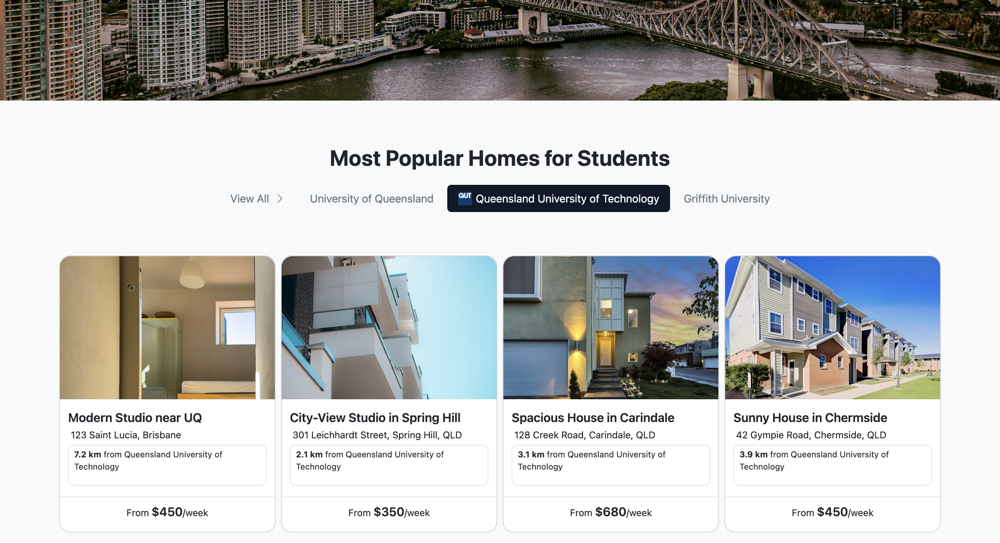

### Homepage filter

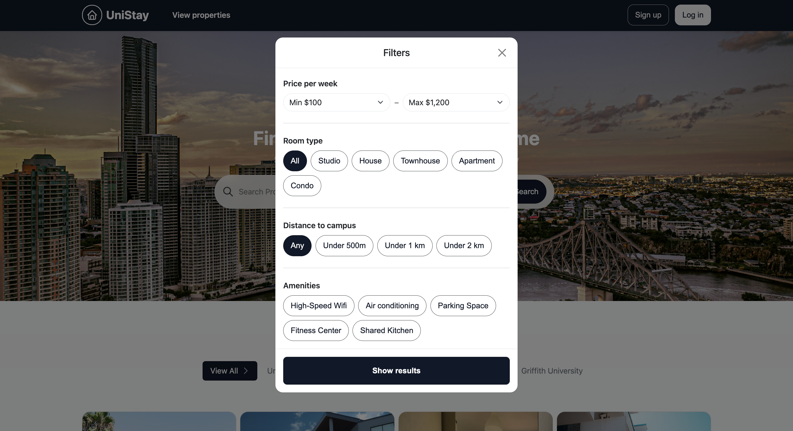

### Property Detail Page as a tenant

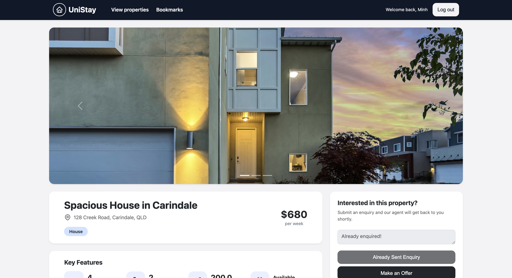
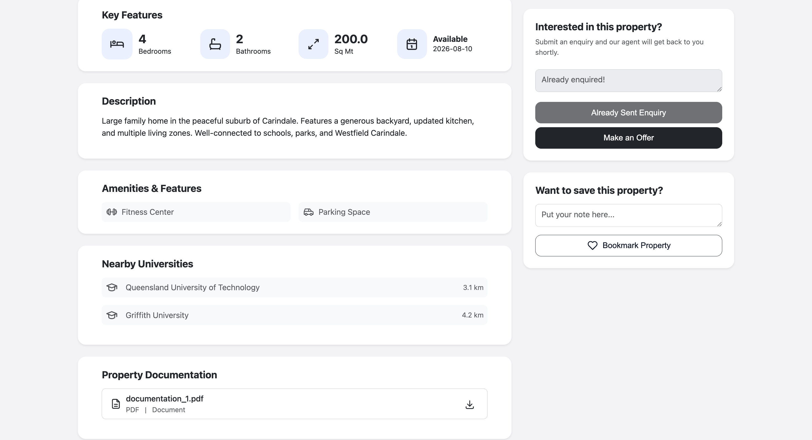

### Saved Properties

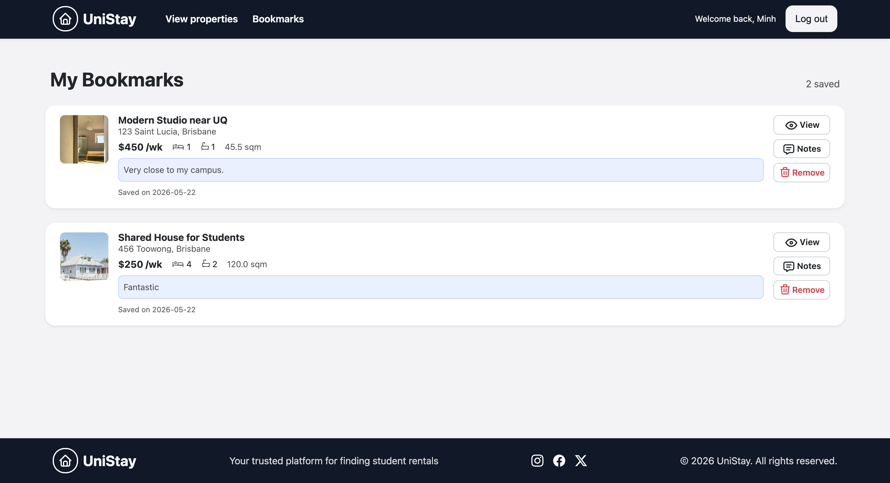

### Agent Dashboard

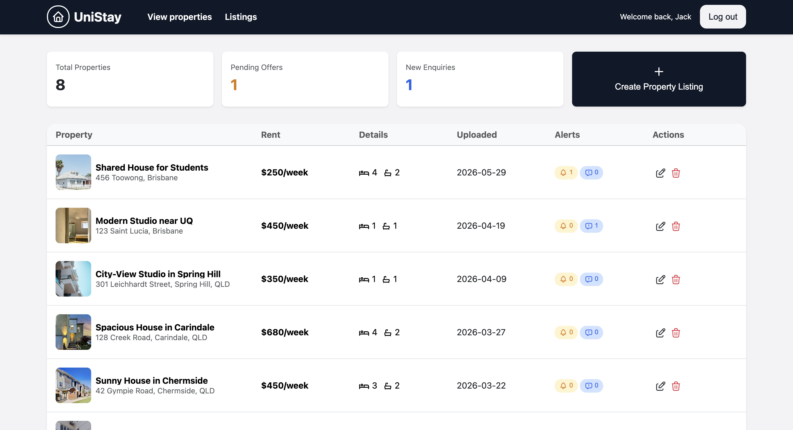

### Agent Listings Edit

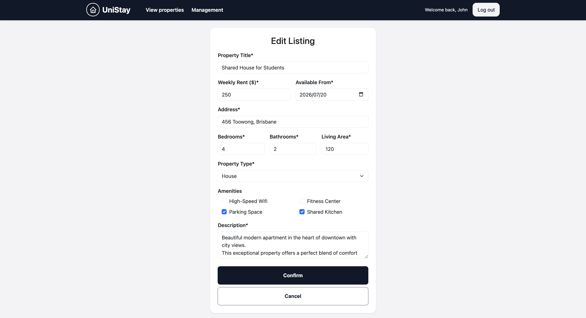

### Agent Enquiries Check

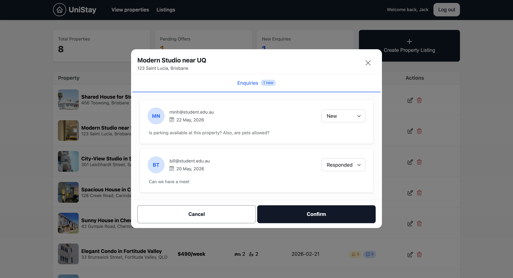

### Admin Dashboard - user management

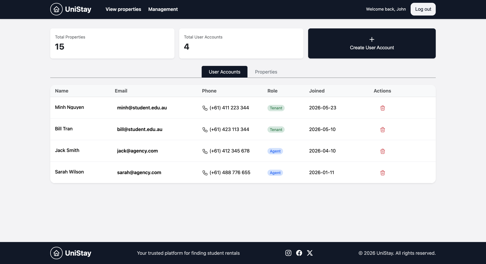

### Admin Dashboard - property management

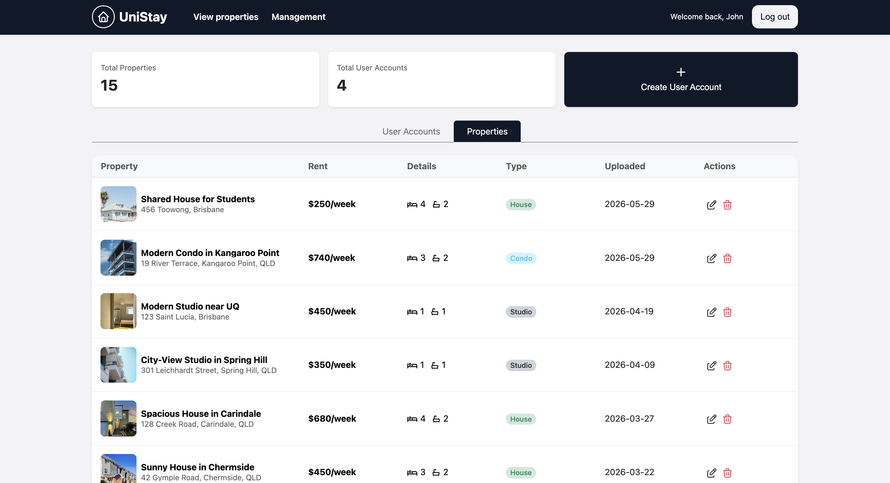

### Login Page

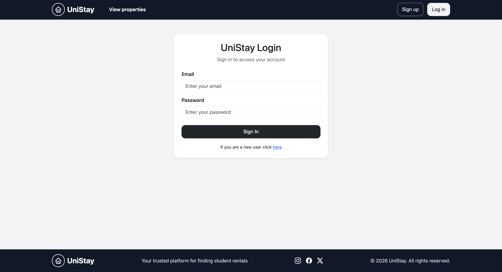

### Sign up Page

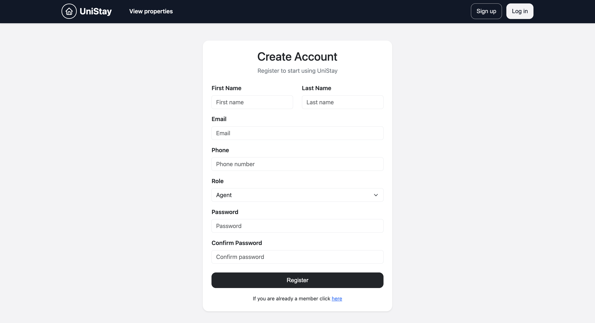
